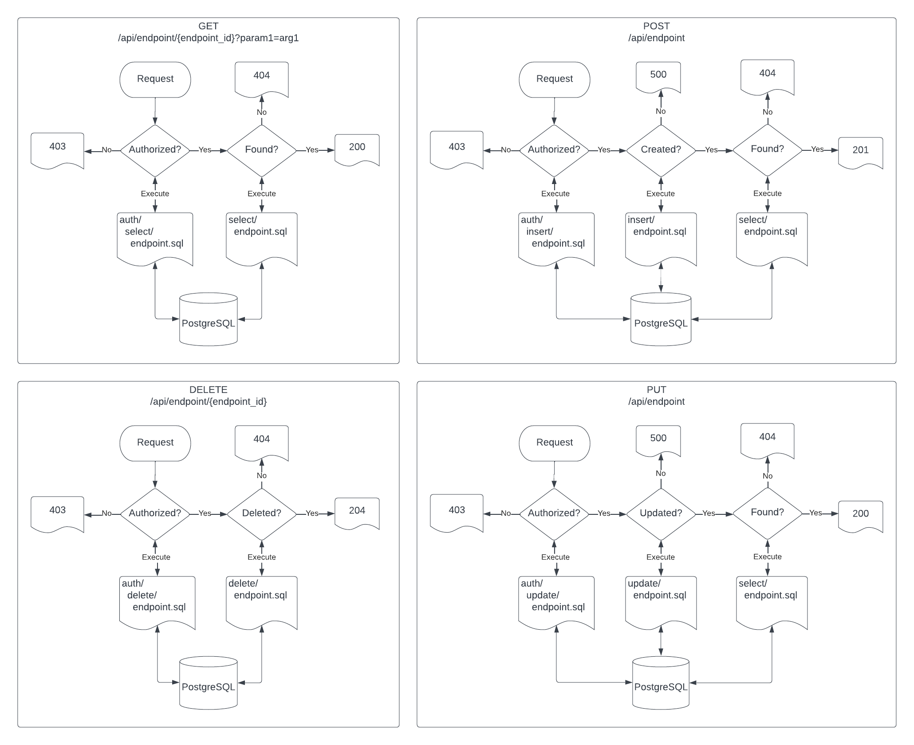

# servotron

## Haiku
<br/>
<p align="center">
A deliverance -<br/>
an app server for Postgres<br/>
without ORM.
</p>
<br/>

## Why
>Although it may seem trite to say it, <i>Object/Relational Mapping is the Vietnam of Computer Science</i>. It represents a quagmire which starts well, gets more complicated as time passes, and before long entraps its users in a commitment that has no clear demarcation point, no clear win conditions, and no clear exit strategy.

https://www.odbms.org/wp-content/uploads/2013/11/031.01-Neward-The-Vietnam-of-Computer-Science-June-2006.pdf

## How
  * SQL.
  * Prepared statements provide authorization and API endpoints. PostgreSQL's row level security is also available.
  * Authorization queries must return a boolean value indicating whether the request is authorized for the user.
  * API queries return JSON (via PostgreSQL's JSON functions).
  * User info is set on a per-request basis.
  * For GET and DELETE requests, arguments parsed from the route and query string are passed in the order they appear in the route specification.
  * For POST and PUT requests, the request body JSON is the first argument. The JSON string can be transformed into a record or recordset (for bulk inserts) via PostgreSQL's JSON functions. The data returned from the INSERT and UPDATE queries should contain the fields required of the associated SELECT for the resource.
  * Service routes are proxied to associated service URLs.

## Diagram



## Dependencies
go

## Install
```bash
git clone
go build
go install
```

## Configuration
```json
{
	"SQLRoot":"~/path/to/api/queries/root/dir",
	"FileServers":{
		"/assets":"~/path/to/static/content/www/assets",
		"/lib":"~/path/to/static/content/www/lib"
	},
	"TemplateServers":{
		"/":"~/path/to/go/templates"
	},
	"AppUserAuth":{
		"ParseFrom":"Header",
		"Field":"Authorization",
		"Type":"JWT"
	},
	"AppUserLocalParams":{
		"info":"~/src/github.com/tinkeractive/servotron/example/api/select/app_user/self.sql",
		"id":"~/src/github.com/tinkeractive/servotron/example/api/select/app_user/id.sql"
	},
	"ListenPort":"80"
	"ManagementPort":"9000",
	"DBConnString":"postgresql://servotron@localhost:5432/postgres",
	"DBPoolSize":4,
	"DBNotifyChannels":["public_default"],
	"Debug":true
}
```
### Root Directories
File paths specified with tilde will resolve to the user home dir.\
This can cause errors when running with `sudo`.

### App User Auth
Used to identify user for authorization.\
Can be parsed from Header or Cookie.\
If ParseFrom is Header, then specify Field and Type (JWT or String). If Type is JWT, then specify Claim. If Claim is empty string, then the entire JWT payload is passed.\
If ParseFrom is Cookie, then specify Name. If Name is empty string, then all cookies are passed as JSON key-value pairs.\
Set in the `app_user.auth` parameter and available via `current_setting` function during request.

### App User Local Params
Used to set parameters for the duration of the request.\
Can also be used for sensible defaults in table definitions.\
The result of the specified query is set in the `app_user.[key]` parameter for the duration of the request.\
Value is available via the `current_setting` function.

### File Servers
Static content such as HTML.

### Template Servers
Templates written in the go text/template style.\
Useful for server side includes.\
Useful for altering content based on user roles/permissions.\
Server passes the result of app user query to the template.

### Management Port
For admin functionality such as route loading.

### Pool Size
If not specified, this defaults to the number of CPUs.

### Notify Channels
Likely to be removed.\
Intended to enqueue messages.\
This functionality can be achieved by writing specialized agent listeners.

### Debug
If true, server writes error message responses to client.

## Route Types
type|HTTP|SQL
----|----|---
create|POST|INSERT
read|GET|SELECT
update|PUT|UPDATE
delete|DELETE|DELETE
transaction|POST|PUT|DELETE|TRANSACTION
service|*|null

Service route type is proxied to the service URL.

# Example

## Prerequisites
```bash
psql -f example/schema/app/public.sql
```

## Run
```bash
servotron --config example/config.cookie.json
```

## Load Routes
```bash
curl localhost:9000/routes -d @example/routes.json
```

## Request
```bash
curl -b 'email_address=user_a@app.com' localhost:8000/api/buckets
[{"bucket_id":1,"name":"bucket_a","active":true}]

curl -b 'email_address=user_a@app.com' localhost:8000/api/bucket -XPOST -d '[{"name":"New Bucket"}]'
[{"bucket_id":3,"name":"New Bucket","active":true}]

curl -b 'email_address=user_a@app.com' localhost:8000/api/buckets
[{"bucket_id":1,"name":"bucket_a","active":true},
 {"bucket_id":3,"name":"New Bucket","active":true}]

curl -b 'email_address=user_a@app.com' localhost:8000/api/bucket/3
{"bucket_id":3,"name":"New Bucket","active":true}

curl -b 'email_address=user_a@app.com' localhost:8000/api/bucket -XPUT -d '{"bucket_id":3,"name":"Newish Bucket"}'
[{"bucket_id":3,"name":"Newish Bucket","active":true}]

curl -b 'email_address=user_a@app.com' localhost:8000/api/buckets
[{"bucket_id":1,"name":"bucket_a","active":true},
 {"bucket_id":3,"name":"Newish Bucket","active":true}]

curl -b 'email_address=user_a@app.com' localhost:8000/api/bucket/3 -XDELETE

curl -b 'email_address=user_a@app.com' localhost:8000/api/buckets
[{"bucket_id":1,"name":"bucket_a","active":true}]

curl -b 'email_address=user_a@app.com' localhost:8000/api/buckets?active=false
[{"bucket_id":3,"name":"Newish Bucket","active":false}]
```

